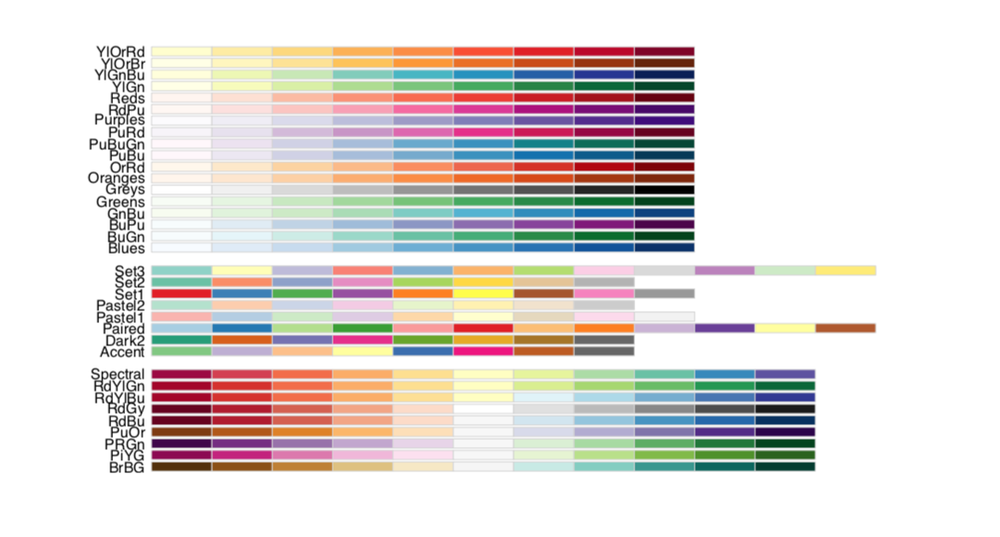
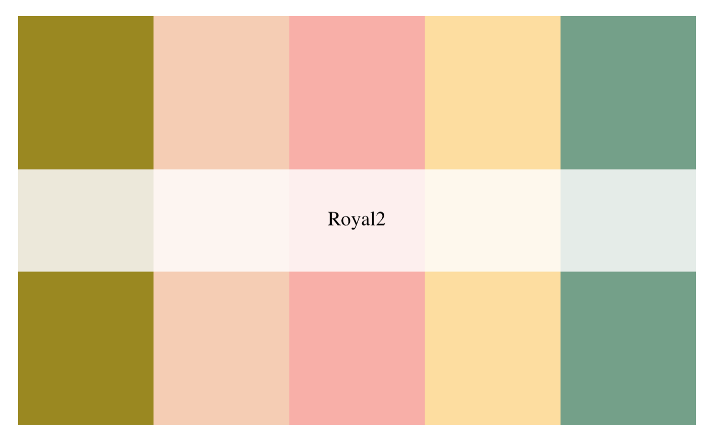

<br>

### introduction

There are many color palettes that you can use to make your ggplot look nicer!  
And here are two examples.

<br>

### ggplot palettes RColorBrewer

RColorBrewer:

Check out the color palettes from RColorBrewer!

library(RColorBrewer)<br>
display.brewer.all()

```{r, out.width = '70%', fig.align="center", echo = FALSE}
library(knitr)

```

<br>

### ggplot palettes RColorBrewer

wesanderson:

Check out the example from the wesanderson!

library(wesanderson)<br>
wes_palette("Royal2")

```{r, out.width = '70%', fig.align="center", echo = FALSE}
library(knitr)

```

